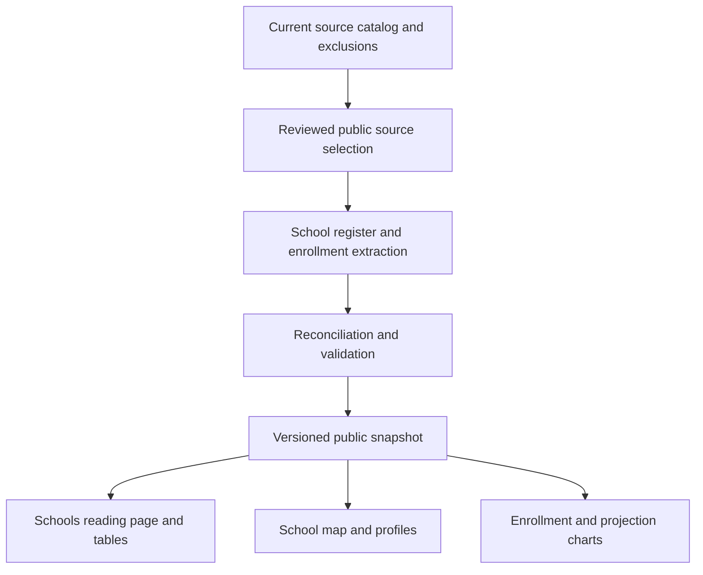

# OpenValley Homes and Schools MVP - Plan

## Goal Capsule

**Objective:** A resident anywhere in HUUSD can understand the schools the district has today, see how enrollment has changed since before the pandemic, and check the evidence behind those numbers.

**Means:** A scrollable Schools page with a current-school map, school profiles, enrollment charts, and source notes, built on a checked public dataset (KTD1–KTD4).

**Authority:** Project data-handling rules govern all collection and publication. The Product Contract governs user-facing behavior; the Planning Contract governs implementation within those limits. This plan supersedes the working notes for this release.

**Execution boundary:** This document plans research, data preparation, and implementation. The present request authorizes writing and reviewing the plan, not building the app or creating GitHub issues. Future work should follow the units in dependency order.

**Stop conditions:** Stop publication of affected figures if their source, population definition, or historical comparability cannot be established. Stop affected ingestion if exclusion checks fail. Record a precise gap rather than inventing a value or restoring excluded material.

**Delivery ownership:** The implementer prepares data and a working preview; the project owner reviews the public explanation before release. GitHub organization follows agreement on this plan.

---

## Product Contract

### Summary

Organize OpenValley into **Homes** and **Schools**. Make Schools a district-wide introduction to HUUSD as it exists today, followed by about ten years of enrollment history and the outlook supported by available evidence. Lead with understanding current schools; add scenario comparisons in a later release.

### Problem Frame

Residents need a shared understanding of the district before they can weigh changes to it. Enrollment figures, school structures, and forecasts are spread across reports and presentations whose definitions and dates may differ. A collection of documents does not yet provide an understandable historical picture.

The user's concern is declining numbers of children and what that means for providing good education. That concern is a question to investigate, not a conclusion to impose on every school or year. Enrollment alone does not establish educational quality, ideal staffing, or whether a building should close.

OpenValley began with parcel and homestead research. That work belongs in Homes, including property taxes. Schools serves all HUUSD communities, with Vermont context where it explains the figures.

### Key Decisions

- **Whole district, all school levels.** Governs R2, R4. (session-settled: user-directed — chosen over a Valley-centered or elementary-only resource: residents across HUUSD should be represented.)
- **Ten years of history.** Governs R6. (session-settled: user-directed — chosen over a short recent window: include the period before the pandemic.)
- **Current schools and enrollment first.** Governs R3–R8. (session-settled: user-approved — chosen over including scenario comparisons in the first release: establish a useful shared baseline first.)
- **Scrollable basics with optional exploration.** Governs R3, R5. (session-settled: user-directed — chosen over a dashboard-only starting point: people should understand the basics without operating filters.)
- **Class size matters more than room counts.** Governs R13. (session-settled: user-directed — chosen over making physical classroom inventory the main measure: understand children's learning groups and useful school capacity.)

### Requirements

**Platform and framing**

- R1. Use Homes and Schools as the platform's primary sections; Homes provides access to the existing housing, parcel, homestead, and property-tax work.
- R2. Identify Schools as coverage of the entire Harwood Unified Union School District in Vermont, with OpenValley clearly identified as the publisher rather than the district.
- R3. Lead with current schools and their structure, then enrollment history and outlook; do not lead with consolidation, cost savings, or a preferred solution.

**Current schools**

- R4. Include every current district school/program grouping needed to represent elementary, middle, and high school, with sourced names, location, grades served, current enrollment date/status, and grade pathways.
- R5. Provide a current-school map and an equivalent selectable school list; either selection opens the same school facts and enrollment detail without losing the reader's place.

**Enrollment and outlook**

- R6. Show a ten-school-year historical window, targeting 2016–17 through 2025–26, with gaps and changes in comparability explicit; a 2026–27 update is additional and retains its preliminary/final status.
- R7. Begin with district-wide enrollment and allow school and available grade detail, using a consistent stated population and count basis within each series.
- R8. Present usable published enrollment projections with their author, publication date, base year, horizon, and assumptions; when no comparable projection is supported, explain the gap without drawing a forecast line.
- R9. Distinguish final observed counts, preliminary observed counts, and projections in both words and chart styling; missing or suppressed figures must never become zero.

**Evidence and usability**

- R10. Attach public sources and page/table references to published figures and school facts, with definitions, dataset update date, and short explanations of material conflicts.
- R11. Apply the canonical project exclusions throughout source selection, derived data, tests, and publication; never expose private working notes or closed-session content through the public release.
- R12. Make the basic story, school information, and numerical tables readable on a phone and with keyboard navigation; information must not depend on hover, map tiles, or color alone.

**Follow-on research**

- R13. Record coverage for teaching positions, actual class sizes, class-size guidance, and meaningful capacity measures, so the next release can be scoped from evidence; these are not prerequisites for the first enrollment release.

### The First Page, in Reading Order

**1. Our schools today**

Open with a short explanation of HUUSD and the communities it serves. Show a map framing the whole district, alongside the school list. Use school names and grade ranges rather than rankings or red/green judgments about size.

The official district directory currently lists Harwood Union Middle and High School, Crossett Brook Middle School, Brookside Primary School, Moretown Elementary School, Waitsfield Elementary School, Fayston Elementary School, and Warren Elementary School. Treat this as the starting roster to verify, not a substitute for dated school profiles. A shared campus and its middle/high programs are not interchangeable counting units.

**2. How the schools fit together**

Explain the verified grade pathways in a short readable diagram/list. A pathway describes the usual structure, not an individual student's guaranteed assignment. Document school choice and other material exceptions with official references. Do not infer attendance zones from nearest-school distance or draw unsourced catchment boundaries.

Selecting a school shows its basic facts, latest supported enrollment, and its history. Keep school names visible; use a clear “All district schools” control to return to the district view. The main ten-year chart defaults to the district, even when a reader has inspected a school above it.

**3. Enrollment over ten years**

Show the district series first, then a school selector and grade detail where supported. Start with counts rather than a percentage-change headline. Show a brief statement of what the data establishes, with no explanation of causes unless independently sourced.

Label academic years fully and identify the pre-pandemic portion of the record. Pandemic timing is context, not proof that the pandemic caused a particular change. Do not describe school enrollment as the total number of children living in the district.

**4. What the available projections say**

Separate this section visibly from recorded history. Explain who made each usable forecast and when. Never silently combine one projection's early years with another's later years. An older forecast may be discussed as historical context, but must not appear as the current outlook.

**5. Where the numbers came from**

Provide the data table, public sources, count definitions, update date, and known gaps. Place brief source notes beside charts as well, so readers do not have to reach the bottom to check a claim.

### Acceptance Examples

- AE1. **Covers R4, R5, R12.** A phone user selects Crossett Brook from the school list and gets the same facts available from its map marker, without needing to operate the map.
- AE2. **Covers R6, R7, R9.** A school has no verified value for one year. The table says “Not available,” the chart has a gap, and change calculations do not substitute zero or bridge the gap without explanation.
- AE3. **Covers R6, R7, R10.** A grade moves between schools. The affected school series carries a dated structural-change note; the page does not present that move as evidence that children left the district.
- AE4. **Covers R8, R9.** A September preliminary count and a later final count exist for the same period and definition. The final count supplies the published point, and the earlier edition remains a source-history record rather than a second enrollment point.
- AE5. **Covers R8, R10.** A forecast's grade coverage differs from the historical series. It is not connected to that line; its separate coverage is explained, or the outlook is marked unavailable.
- AE6. **Covers R1.** A reader follows an existing housing link directly and still reaches the original work; Homes makes that work discoverable through the new navigation.
- AE7. **Covers R11.** A source becomes excluded after a prior dataset build. Rebuilding rejects its derived rows and stale public output; test fixtures and deployed data cannot retain the excluded contribution.

### Scope Boundaries

**First release:** current-school explanation, map/list, basic school profiles, enrollment history, evidence-supported published outlook, sources and methods, and minimal Homes/Schools organization.

**Deferred to follow-up work:** scenario maps; consolidation comparisons; teacher trends; actual class-size comparisons and guidance; capacity studies; budget/tax effects; custom forecasting; school-quality measures; meeting timelines; document chat; detailed redesign of Homes.

**Considered and not built:** a new school database/API, automated archive-to-public publishing, user accounts, or a general data dashboard framework. The first release is a small curated dataset and reading experience. Revisit only when updates or user needs demonstrate that the simpler approach no longer works.

### Proposed Success Check

Before release, ask a reader to identify the schools and grades in the district, describe the observed enrollment change, distinguish an actual count from a forecast, and find a source for one figure. Revise any part of the page that prevents those tasks. This is a proposed qualitative check, not a measured result or an analytics requirement.

---

## Planning Contract

### Existing Evidence and Constraints

- `web/package.json` declares Next.js 16.1.1, React 19.2.3, MapLibre, Leaflet/React Leaflet, and Recharts. The repository already contains property maps, a scrolling story route, and chart components; reuse suitable patterns rather than introduce a separate application.
- `docs/school-board/README.md` describes the broader editorial work. Its scenario and meeting ideas remain follow-on context; this plan narrows the first release to the agreed baseline.
- The shared collection's README and current catalog are the source-discovery entry points. Resolve its local location from `AGENTS.md`; do not embed machine-specific archive paths in public assets or this implementation contract.
- The current catalog contains locally available enrollment-source candidates from 2016, 2017, 2018, and recent presentations. Titles and file presence were checked; the numerical tables have not been extracted or verified by this planning work.
- [PR #9](https://github.com/Starling-Strategy/open-valley/pull/9), merged October 4, 2026, supplies the versioned exclusion policy, cleanup/catalog tools, deletion metadata, and synthetic regression workflow. Its reviewed head is `c01f8a2b3916c43b9b7bfa7e569d7a00baab382e`; the local copies of these tools and the cleanup report match that revision. The PR's School Board Privacy Regressions check passed.
- `docs/school-board/privacy-cleanup.md` reports completed OCR screening of 1,538 retained documents, including 13,817 low-native-text pages, with contextual review of every OCR candidate page. This supersedes the earlier session update that OCR was still running. It establishes neither numerical accuracy nor publication clearance.
- The cleanup report records 195 pages still yielding fewer than 40 characters, a later caucus-pattern native review that was not retroactively applied to the original OCR pass, and caption-based rather than full independent audio review of the saved video. Check relevant source pages directly; do not make the enrollment release depend on restarting a collection-wide OCR or audiovisual project.

### What PR #9 Changes in This Plan

The collection foundation is already delivered. U1 begins with the existing filtered catalog and source-specific verification, rather than rebuilding collection or privacy tooling. U2 still has to extract and reconcile enrollment numbers; the privacy scan deliberately retained locators and counts, not extracted source text.

Three distinct checks remain separate:

1. **Collection integrity and known exclusions:** reuse PR #9's tools and reports.
2. **Public-source suitability:** confirm that each selected record can support public use; presence in the filtered research catalog is not permission to publish it.
3. **Numerical accuracy and comparability:** visually verify the tables, definitions, and calculations used by the enrollment page.

### Key Technical Decisions

- KTD1. **Publish a curated snapshot, not the research archive.** Keep the small reviewed records under `data/school-board/public/` and generate a frontend snapshot in `web/src/data/schools/`. Source documents stay in the shared collection. This implements R10–R11 without a database migration or runtime access to private materials.
- KTD2. **Separate geography, school identity, and observations.** A campus location, a school/program identity, a dated grade configuration, and an enrollment observation are separate records. This permits one campus marker for a combined middle/high school while preserving distinct reporting groups where sources support them.
- KTD3. **Reuse the existing frontend.** Add `/schools` and a lightweight `/homes` entry point. Preserve existing property URLs. Limit shared changes to navigation, publisher-level metadata, and the landing page needed to make both sections findable.
- KTD4. **Use map and chart components only for interaction.** Render explanatory text, school facts, and data tables through the page; load the map on the client using an existing map-loader pattern. A map failure must not remove access to school information (R12).
- KTD5. **Keep publication reproducible and deliberate.** A validation/build step consumes only reviewed structured rows whose public sources resolve through the current catalog and exclusion rules. Track each derived figure's contributing source IDs and source-edition hashes: a derived JSON file will not share the excluded original's byte hash. It generates one versioned frontend snapshot. On ordinary validation failure, preserve the previous snapshot only if it remains eligible under current exclusions. An exclusion invalidates affected existing output immediately, even when no replacement snapshot can be built; remove affected local and deployed derivatives under R11.
- KTD6. **Use one population definition per plotted series.** Target unweighted headcounts attending HUUSD-operated K–12 schools, with PK shown separately where supported. Retain resident enrollment, tuitioned students, weighted pupil counts, and projections as distinct measures rather than force them into this series. Confirm the chosen basis in U1 before extracting U2.

### Data Design

Proposed files are additions, not claims about existing datasets.

| Record | Proposed file | Required meaning |
|---|---|---|
| School/campus register | `data/school-board/public/schools.json` | Stable IDs, names and historical aliases, verified locations, dated grades served, public references |
| Enrollment observations | `data/school-board/public/enrollment.csv` | School/program or district ID, school year, reference date, grade scope, population basis, headcount, observed/preliminary status, source and locator |
| Published projections | `data/school-board/public/projections.csv` | Forecast vintage, author, base year, projected year, geography/grade scope, value, assumptions and source |
| Public source register | `data/school-board/public/sources.json` | Catalog source ID, verified public original URL, reviewed edition/hash, publication date where known, page/table locator and public-use verification date |
| Coverage and reconciliation | `docs/school-board/enrollment-coverage.md` | Available years, missing records, incompatible definitions, district reconciliation, accepted editions, unresolved conflicts |
| Frontend snapshot | `web/src/data/schools/snapshot.json` | Validated public records, derived display series with contributing source references, explanatory notes, dataset date and exclusion-policy digest |

Preserve source-reported totals separately from derived totals. Derive a district sum only when school records form a complete, non-overlapping population for the same period. PK, combined school/program totals, and different reference dates are common double-counting risks.

The observation key includes the population and count basis, not only school and year. A reporting break starts a new comparable series segment. Historical aliases preserve a school's identity only when evidence supports continuity; a reconfiguration is not automatically a rename.

Missing, suppressed, and not-applicable are distinct states. Do not infer a suppressed component from totals. Do not derive class size from student/teacher ratios or total enrollment alone.

### Source Selection and Verification

1. Select dated district enrollment reports from the current filtered catalog and confirm their public originals and reviewed editions. Do not copy catalog observations or private working notes into the public source register. Compare against suitable Vermont Agency of Education records when they use the same population and reference period.
2. Inspect the original table visually after text extraction or OCR. Check headers, grade labels, totals, and footnotes; PR #9's completed privacy screening is not numerical verification. Use its metadata-only page locators to identify relevant low-text or review gaps. If a needed table remains illegible, seek a better public original or record the affected data as unavailable.
3. Record the exact edition used. Prefer final over preliminary records for the same definition and date; a newer document does not automatically supersede a differently defined count.
4. Reconcile school sums against independently reported district totals where available. Explain discrepancies rather than adjusting numbers merely to make them match.
5. Record every unavailable year and the specific missing source or definition. Seek the missing public record before deciding a gap cannot be filled.
6. Select projections only after comparing their base-year figures and coverage with the observed series. Do not manufacture confidence intervals or extrapolate a straight line for the first release.

### High-Level Technical Design

The public snapshot is the sole numerical input to page text, charts, and profiles. Any computed headline uses the same validated series as its chart.

### Assumptions and Release Gates

- **Historical window:** 2016–17 through 2025–26 is the proposed fixed baseline; U1 determines availability and comparability. Do not quietly shorten it to the easiest years. Explain documented gaps or bring a material scope change back to the owner.
- **Population:** KTD6 is a planning default awaiting source verification. If the records cannot support it, settle the displayed definition before chart implementation.
- **Current year:** 2026–27 may still have only preliminary observations. A school-directory marketing paragraph is not a dated enrollment record.
- **Outlook:** a projections section is in scope; whether it contains a chart or an explicit evidence gap depends on U2. Custom estimates need a separately agreed method.
- **Presentation:** a simple scrollable page with optional selection is sufficient. No scroll-driven animation or scenario switcher is assumed.
- **Publication prerequisites:** no numerical source table, complete roster/pathway register, or ten-year series has yet been verified. Data work can begin from this plan; full public-release implementation must respect U1/U2's evidence gates.

### Integration With the Other Work

PR #9 supplies the collection's catalog, review, deletion, and verification tooling. This plan adds public numerical evidence selection, enrollment extraction, reconciliation, and presentation. Reuse its catalog IDs and tools; do not build another general crawler, privacy scanner, or archive-cleanup system.

Use `SCHOOL_BOARD_ROOT` as the collection location. The versioned manifests are `data/school-board/privacy-exclusions.json` and `data/school-board/privacy-deletions.json`; the collection's `reports/` entries link to them in this checkout. Follow `scripts/school_board/README.md` when setting up another checkout, and confirm that the manifests are current before ingestion.

Reuse `privacy_rules.load_rules` for manifest validation and `canonical_id` for source identity. UUID spelling variants normalize together; Drive and YouTube case and punctuation remain significant. Apply source-ID, collection-relative-path, and original-content-hash exclusions. `privacy_filter.py` loads its root and rules at import time: set the environment before invoking it, or explicitly load fresh rules for each build. Missing or malformed rules must stop publication rather than become an empty exclusion policy.

The builder must not import the full catalog as frontend data. Its observations can include private context, and retained records can still need public-use review. Resolve reviewed public source references through it, then emit only the public fields described above.

At handoff, record the catalog generation date, manifest digest, and verification result used for the dataset. Recheck exclusions at every rebuild and before publication. `verify_collection.py` checks retained-file integrity and deletion receipts; `verify_privacy.py` checks known exclusions across the local collection and sibling archives. Neither verifies a deployed website or automatically removes newly generated numerical derivatives. U3 must implement that lineage check, and the release owner must remove affected deployed artifacts under R11.

---

## Implementation Units

### U1. Establish the school register and enrollment coverage

**Goal:** Know which schools and reporting periods can be represented accurately.

**Requirements:** R2, R4, R6–R11, R13.

**Dependencies:** PR #9's merged tools, current filtered catalog, and current exclusion manifests. Confirm collection integrity and known-exclusion verification for the input snapshot; no app implementation required.

**Files:** Create `docs/school-board/enrollment-coverage.md`, `docs/school-board/school-register-notes.md`, and `docs/school-board/staffing-class-size-coverage.md`.

**Approach:** Start from the delivered collection and its verification reports. Verify current schools, grade ranges, campus locations, usual pathways, and exceptions against public official sources. Inventory the target ten years plus the current update and available forecasts, identifying any selected source pages affected by documented readability/review gaps. Identify historical reorganizations and report definitions. Record staffing/class-size source coverage without making it a release dependency.

**Patterns to follow:** `scripts/school_board/README.md`, `docs/school-board/privacy-cleanup.md`, and the shared collection's source identifiers and coverage conventions.

**Test expectation:** No new automated tests for a research inventory. Verify each register fact and coverage claim against its cited source.

**Verification:** Every school is accounted for; every target year has a candidate source or explicit gap; a primary population/count basis is selected. Unresolved definitions block U2's affected series, not unrelated research.

### U2. Produce the checked public enrollment dataset

**Goal:** Supply trustworthy, comparable numbers with traceable evidence.

**Requirements:** R6–R11; AE2–AE5, AE7.

**Dependencies:** U1's school identities, population definition, and source selections.

**Files:** Create the four public data files in the Data Design table; update `docs/school-board/enrollment-coverage.md`.

**Approach:** Extract and visually check source tables. Resolve duplicates and count-basis conflicts. Separate combined totals from components. Record source editions and forecast vintages. Build reconciled district and school series under KTD2/KTD6.

**Patterns to follow:** Current catalog provenance and canonical exclusions; preserve source documents in the existing collection.

**Test expectation:** No implementation test for manual extraction itself. Check every published value against its original table; use U3's automated validation to catch structural and arithmetic errors.

**Verification:** Public source locators support every row; comparability breaks and differences between district totals and school sums are explained. Unsupported school/grade detail remains unavailable. U3 must validate the resulting dataset before it enters the app.

### U3. Validate and build the public snapshot

**Goal:** Make dataset updates repeatable without importing private or excluded content.

**Requirements:** R7, R9–R11; AE2, AE4, AE7.

**Dependencies:** U1 for schema meaning; U2 for the first publishable data.

**Files:** Create `scripts/school_board/build_public_snapshot.py`, `scripts/school_board/test_public_snapshot.py`, `web/src/data/schools/snapshot.json`, and `web/src/lib/schools.ts`; update `scripts/school_board/README.md` and `.github/workflows/school-board-privacy.yml`.

**Approach:** Implement KTD1/KTD5 using PR #9's validated rules and identity normalization. Validate IDs, nonnegative integer headcounts, dates, duplicate keys, public-source eligibility, exclusion membership, coverage, and documented reconciliation exceptions. Check contributing-source lineage for derived figures. Generate only the allowlisted public fields. Extend the existing synthetic regression workflow rather than create a second privacy workflow; include the new frontend snapshot and school-data adapter paths in its triggers. Keep shared-storage verification separate from archive-free CI.

**Patterns to follow:** `scripts/school_board/privacy_rules.py` (`load_rules`, `canonical_id`), `scripts/school_board/privacy_filter.py` (`excluded`), and `scripts/school_board/test_privacy.py`. Use Python 3.11 or newer. Keep any numerical-extraction OCR dependencies in the research tool environment, not the frontend or synthetic CI environment.

**Test scenarios:**
1. Valid source-backed rows produce the same snapshot on repeated builds, apart from explicit build metadata.
2. Duplicate editions do not double-count a school's enrollment.
3. Missing values remain missing, and combined school totals cannot be added to their own components.
4. Starting with a previously valid synthetic snapshot, newly excluding its source removes the affected existing output even when replacement generation fails, and prevents stale output from being published.
5. A private URL, absent source locator, or unknown school ID fails validation with a useful record-level message.
6. Incompatible dates/grade scopes cannot silently form a district total.
7. Missing or malformed exclusion manifests block generation; a new build observes policy changes rather than reusing previously imported rules.
8. A derived total with a newly excluded contributor is invalidated even though its output bytes do not match the original's hash; allowed public procedural references remain eligible for separate numerical/public-use review.

**Verification:** Synthetic cases pass; real data validates; the generated file contains no local archive paths, private notes, or fields outside the public contract.

### U4. Add the Homes and Schools entry points

**Goal:** Make both subjects easy to find while preserving access to the original work.

**Requirements:** R1–R3; AE6.

**Dependencies:** None on numerical data; coordinate with other frontend changes.

**Files:** Update `web/src/app/page.tsx`, `web/src/app/layout.tsx`, and the existing navigation/footer components; create `web/src/app/homes/page.tsx`. Add navigation coverage to `web/tests/schools.spec.ts` when U6 establishes browser tests.

**Approach:** Give the platform Homes and Schools destinations. Make Homes a small introduction linking to existing property experiences. Keep existing URLs and avoid moving the property implementation. Set section-appropriate metadata and publisher identity.

**Patterns to follow:** Existing App Router pages and shared layout/navigation conventions.

**Test scenarios:**
1. Both primary destinations work from desktop and mobile navigation.
2. Existing property story, exploration, and learning links remain usable through direct navigation.
3. Schools metadata describes HUUSD in Vermont rather than Warren housing.

**Verification:** Browser checks cover entry points and old property routes without regressions.

### U5. Build the current-school reading experience and map

**Goal:** Let readers understand today's district before interpreting change.

**Requirements:** R2–R5, R10, R12; AE1.

**Dependencies:** U1/U3 for verified school facts and snapshot, U4 for navigation.

**Files:** Create `web/src/app/schools/page.tsx`, `web/src/components/schools/SchoolOverview.tsx`, `web/src/components/schools/SchoolMap.tsx`, `web/src/components/schools/SchoolMapLoader.tsx`, and `web/src/components/schools/SchoolProfile.tsx`; extend `web/tests/schools.spec.ts`.

**Approach:** Build the page in the agreed reading order. Use one selection state for the school map and list. Render factual content independently of the map. Show the district-wide geography, dated grade pathways, and per-school information from KTD1's snapshot.

**Patterns to follow:** Existing map-loader/client component split; use school-specific bounds rather than inherited Warren parcel bounds.

**Test scenarios:**
1. A map marker and its matching list control display the same profile.
2. Keyboard-only users reach every school and can return to the district overview.
3. Failure to load map tiles leaves the list, school facts, and page narrative usable.
4. Multiple reporting programs at one campus appear without duplicate enrollment totals.
5. A missing school count is labeled unavailable rather than omitted or shown as zero.

**Verification:** Desktop/mobile browser review confirms all schools are represented and the scroll narrative remains readable with the map unavailable.

### U6. Add history, outlook, sources, and release checks

**Goal:** Complete the enrollment story with evidence readers can inspect.

**Requirements:** R6–R12; AE2–AE5.

**Dependencies:** U2/U3 for validated series; U5 for page structure.

**Files:** Create `web/src/components/schools/EnrollmentHistory.tsx`, `web/src/components/schools/EnrollmentOutlook.tsx`, `web/src/components/schools/EnrollmentTable.tsx`, and `web/src/components/schools/SourceNotes.tsx`; extend `web/src/lib/schools.ts` and `web/src/app/schools/page.tsx`; add `web/tests/schools.spec.ts`, `web/playwright.config.ts`, and the browser-test dependency/script in `web/package.json`; update `docs/school-board/README.md`.

**Approach:** Use existing chart patterns for actual/preliminary/projected series. Keep chart/table filters synchronized within the history section. Explain comparable endpoints for change calculations. Add the supported forecast or its explicit gap statement. Establish focused browser tests for this new user flow rather than broad testing infrastructure.

**Test scenarios:**
1. District is the history default; selecting a school updates chart, table, title, and notes together.
2. Missing years and structural breaks remain visible; unavailable grade options are explained.
3. Preliminary and forecast values stay distinguishable in chart, table, and source notes.
4. A forecast with incompatible coverage cannot appear as a continuation of actual history.
5. Source links and locators let a reader find the selected figure's public record.
6. On a phone, labels and controls fit; tables remain usable; core information is available without hover.

**Verification:** All Verification Contract gates pass, followed by owner review of the actual page and its explanation of the data.

---

## Verification Contract

These checks belong to implementation; they have not been run as part of writing this plan.

| Gate | Evidence required |
|---|---|
| Source verification | U1/U2 coverage reports, per-value original-table checks, dated school register, documented discrepancies |
| Data correctness | Python unittest coverage in `scripts/school_board/test_public_snapshot.py`, plus successful real-data validation |
| Exclusion handling | Existing PR #9 tests and new snapshot tests pass using `python3 -m unittest discover -s scripts/school_board -p 'test_*.py' -v`; CI uses synthetic fixtures, not the shared archive |
| Frontend quality | Existing `npm run lint` and `npm run build` from `web` pass for the change; unrelated baseline failures are separately identified |
| Browser behavior | Proposed Playwright test script exercises `web/tests/schools.spec.ts` against a running app, including mobile, keyboard use, and map failure |
| Public explanation | Owner checks current-school framing, district-wide coverage, count definitions, observed/projected distinction, sources, and neutral language |
| Release contents | Only curated public snapshot data enters the frontend; current exclusions and derived-source lineage are checked immediately before publication, with policy digest recorded |

PR #9's existing School Board Privacy Regressions CI check was confirmed passing during this plan update. That result covers its synthetic cases, not the future snapshot builder or the enrollment figures. For actual collection refresh/verification, use the ordered commands in `scripts/school_board/README.md`; these require shared storage and produce local reports. Do not run them against a fabricated empty collection in ordinary frontend CI.

No production deployment target change is required by this plan. The existing deployment must include the frontend snapshot and must not copy the source archive into public assets. The new snapshot checks must run when the generated snapshot changes, not only when research scripts change.

---

## Definition of Done

- Homes and Schools are findable, and old property links work.
- Every current HUUSD school is represented with verified basic facts and an accessible map/list experience.
- The target ten-year enrollment view includes pre-pandemic data and explicitly documents unavailable or incomparable periods.
- All displayed numbers, notes, and calculations derive from the checked snapshot and have public citations.
- The outlook contains a supported published projection or an honest evidence-gap explanation.
- The page passes the data, privacy, frontend, browser, and editorial checks above.
- Updating the dataset is documented and repeatable; source exclusions propagate through derived and published copies.
- Staffing, class-size, and capacity research gaps are recorded for the next planning discussion.
- Abandoned experiments, fabricated demo numbers, and unused implementation code are removed before release.

---

## GitHub Organization After Plan Agreement

Create one parent issue, **OpenValley Schools: current schools and enrollment**, linking this plan and merged PR #9 as its delivered collection/privacy foundation. Use U1–U6 as the initial child-issue boundaries, preserving their dependencies and acceptance checks. U1 and U2 are research/data tasks; U3–U6 are implementation tasks. Do not create another issue to repeat PR #9's completed cleanup or original OCR pass.

Suggested delivery checkpoints:

1. **Evidence ready:** school register, coverage report, population definition, and first checked district series.
2. **Preview ready:** Homes/Schools navigation, current-school map/list, and historical enrollment view.
3. **Release ready:** supported outlook or gap explanation, complete source notes, verified data, and browser/editorial review.

Keep later scenario work and teacher/class-size analysis as separate follow-up issues. They can reuse the school identities, source register, and checked baseline without expanding this first release.

---

## Sources and Research

- `AGENTS.md`: canonical data-handling constraints and shared collection location.
- [PR #9: keep executive-session material out of school-board data](https://github.com/Starling-Strategy/open-valley/pull/9): merged foundation, reviewed at head `c01f8a2b3916c43b9b7bfa7e569d7a00baab382e` on 2026-10-04.
- `docs/school-board/privacy-cleanup.md`: completed review evidence and remaining limits.
- `scripts/school_board/README.md`, `privacy_rules.py`, `privacy_filter.py`, `verify_collection.py`, `verify_privacy.py`, and `test_privacy.py`: existing ingestion boundary and validation interfaces; script filenames here are relative to `scripts/school_board/`.
- `.github/workflows/school-board-privacy.yml`: existing synthetic regression check to extend in U3.
- `docs/openvalley-mvp-working-notes.md`: conversation decisions leading to this plan.
- `docs/school-board/README.md`: broader editorial context.
- `web/package.json`: current frontend dependencies and available scripts.
- Shared collection `README.md`, `catalog/sources.json`, and `catalog/summary.json`: discovery/provenance, not proof of numerical comparability.
- [HUUSD school directory](https://huusd.org/our-schools), accessed 2026-10-04: initial school roster; undated enrollment descriptions are not accepted as current counts.
- [November 2016 enrollment trends](https://drive.google.com/file/d/1g7PC4OTz2KsWShYNSd0p4DouDdfsOoP2/view): cataloged candidate for historical coverage; contents require verification.
- [May 2017 enrollment information](https://drive.google.com/file/d/11gpwb_XdMF10HJADFPL1ytExdsxlLrmB/view): cataloged historical candidate.
- [2018 NESDEC enrollment projections](https://drive.google.com/file/d/0B2uQwDkbPKEVUWFkaTFlUXBHN1hjaXVweU42THhfSzM2Yy1Z/view): historical forecast candidate, not presumed current.
- [September 2026 preliminary enrollment update](https://docs.google.com/presentation/d/1EwSuAJSRB2LzbzVriNOn5xya5ULajgBv/edit): cataloged current-period candidate; retain preliminary status unless a final replacement is verified.
- [Year-over-year enrollment trends](https://docs.google.com/presentation/d/196MS-2vANg6_awxanmAbUyV_wlqzgaKVY90-AHEQkiE/edit): cataloged candidate; reporting periods and definitions require verification.
