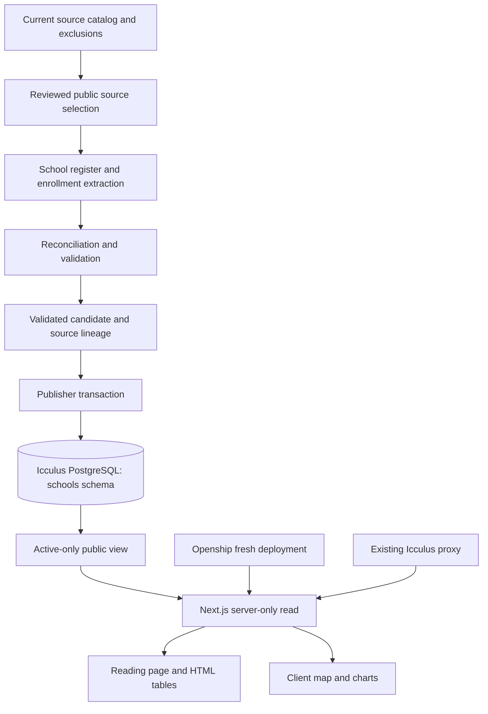

# Open Valley Homes and Schools — Integrated Delivery Plan

## Goal Capsule

**Objective:** A resident anywhere in HUUSD can understand the schools the district has today, see how enrollment has changed since before the pandemic, and check the evidence behind those numbers.

**Means:** A school-first reading experience backed by the existing PostgreSQL database, with a fresh application deployment on Icculus through Openship (KTD1–KTD8).

**Authority:** Project data-handling rules govern all collection and publication. The Product Contract governs user-facing behavior; the Planning Contract governs implementation within those limits. This plan supersedes the working notes for this release.

**Execution boundary:** This revision is planning work. Once execution is authorized, the agent owns evidence preparation, design, implementation, verification, documentation, and deployment through the Definition of Done. The current planning pass does not deploy services or publish unverified data.

**Stop conditions:** Stop publication of affected figures if their source, population definition, or historical comparability cannot be established. Stop affected ingestion if exclusion checks fail. Record a precise gap rather than inventing a value or restoring excluded material.

**Delivery ownership:** The implementing agent owns integration and release. Use bounded specialist work for research and independent review; keep schema, shared UI, and deployment decisions with one integrator. Routine design choices, source reconciliation, tests, and repairs do not require owner approval. Escalation boundaries are defined under Autonomous Delivery.

---

## Product Contract

### Summary

Organize OpenValley into **Homes** and **Schools**. Make Schools a district-wide introduction to HUUSD as it exists today, followed by about ten years of enrollment history and the outlook supported by available evidence. Lead with understanding current schools; add scenario comparisons in a later release.

### Problem Frame

Residents need a shared understanding of the district before they can weigh changes to it. Enrollment figures, school structures, and forecasts are spread across reports and presentations whose definitions and dates may differ. A collection of documents does not yet provide an understandable historical picture.

The user's concern is declining numbers of children and what that means for providing good education. That concern is a question to investigate, not a conclusion to impose on every school or year. Enrollment alone does not establish educational quality, ideal staffing, or whether a building should close.

OpenValley began with parcel and homestead research. That work belongs in Homes, including property taxes. Schools serves all HUUSD communities, with Vermont context where it explains the figures.

### Key Decisions

- **Whole district, all school levels.** Governs R2, R4. (session-settled: user-directed — chosen over a Valley-centered or elementary-only resource: residents across HUUSD should be represented.)
- **Ten years of history.** Governs R6. (session-settled: user-directed — chosen over a short recent window: include the period before the pandemic.)
- **Current schools and enrollment first.** Governs R3–R8. (session-settled: user-approved — chosen over including scenario comparisons in the first release: establish a useful shared baseline first.)
- **Scrollable basics with optional exploration.** Governs R3, R5. (session-settled: user-directed — chosen over a dashboard-only starting point: people should understand the basics without operating filters.)
- **Class size matters more than room counts.** Governs R13. (session-settled: user-directed — chosen over making physical classroom inventory the main measure: understand children's learning groups and useful school capacity.)
- **One integrated delivery plan.** Governs R14–R16. (session-settled: user-approved — revise this plan in place rather than create a competing document; include design, infrastructure, and documentation.)

### Requirements

**Platform and framing**

- R1. Use Homes and Schools as the platform's primary sections; preserve access to verified public housing, parcel, homestead, and property-tax work under the route contract below.
- R2. Identify Schools as coverage of the entire Harwood Unified Union School District in Vermont, with OpenValley clearly identified as the publisher rather than the district.
- R3. Lead with current schools and their structure, then enrollment history and outlook; do not lead with consolidation, cost savings, or a preferred solution.

**Current schools**

- R4. Include every current district school/program grouping needed to represent elementary, middle, and high school, with sourced names, location, grades served, current enrollment date/status, and grade pathways.
- R5. Provide a current-school map and an equivalent selectable school list; either selection opens the same school facts and enrollment detail without losing the reader's place.

**Enrollment and outlook**

- R6. Show a ten-school-year historical window, targeting 2016–17 through 2025–26, with gaps and changes in comparability explicit; a 2026–27 update is additional and retains its preliminary/final status.
- R7. Begin with district-wide enrollment and allow school and available grade detail, using a consistent stated population and count basis within each series.
- R8. Present usable published enrollment projections with their author, publication date, base year, horizon, and assumptions; when no comparable projection is supported, explain the gap without drawing a forecast line.
- R9. Distinguish final observed counts, preliminary observed counts, and projections in both words and chart styling; missing or suppressed figures must never become zero.

**Evidence and usability**

- R10. Attach public sources and page/table references to published figures and school facts, with definitions, dataset update date, and short explanations of material conflicts.
- R11. Apply the canonical project exclusions throughout source selection, derived data, tests, and publication; never expose private working notes or closed-session content through the public release.
- R12. Make the basic story, school information, and numerical tables readable on a phone and with keyboard navigation; information must not depend on hover, map tiles, or color alone.

**Follow-on research**

- R13. Record coverage for teaching positions, actual class sizes, class-size guidance, and meaningful capacity measures, so the next release can be scoped from evidence; these are not prerequisites for the first enrollment release.

**Delivery and operation**

- R14. Deliver a coherent editorial design, checked in the running application against the Visual Design Contract.
- R15. Serve the release from Icculus through Openship using its existing PostgreSQL infrastructure, with a repeatable update, withdrawal, and recovery procedure.
- R16. Give the next contributor one clear documentation entry point and verified instructions for local development, publication, and deployment.

### The First Page, in Reading Order

**1. Our schools today**

Open with a short explanation of HUUSD and the communities it serves. Show a map framing the whole district, alongside the school list. Use school names and grade ranges rather than rankings or red/green judgments about size.

The official district directory currently lists Harwood Union Middle and High School, Crossett Brook Middle School, Brookside Primary School, Moretown Elementary School, Waitsfield Elementary School, Fayston Elementary School, and Warren Elementary School. Treat this as the starting roster to verify, not a substitute for dated school profiles. A shared campus and its middle/high programs are not interchangeable counting units.

**2. How the schools fit together**

Explain the verified grade pathways in a short readable diagram/list. A pathway describes the usual structure, not an individual student's guaranteed assignment. Document school choice and other material exceptions with official references. Do not infer attendance zones from nearest-school distance or draw unsourced catchment boundaries.

Selecting a school shows its basic facts, latest supported enrollment, and its history. Keep school names visible; use a clear “All district schools” control to return to the district view. The main ten-year chart defaults to the district, even when a reader has inspected a school above it.

**3. Enrollment over ten years**

Show the district series first, then a school selector and grade detail where supported. Start with counts rather than a percentage-change headline. Show a brief statement of what the data establishes, with no explanation of causes unless independently sourced.

Label academic years fully and identify the pre-pandemic portion of the record. Pandemic timing is context, not proof that the pandemic caused a particular change. Do not describe school enrollment as the total number of children living in the district.

**4. What the available projections say**

Separate this section visibly from recorded history. Explain who made each usable forecast and when. Never silently combine one projection's early years with another's later years. An older forecast may be discussed as historical context, but must not appear as the current outlook.

**5. Where the numbers came from**

Provide the data table, public sources, count definitions, update date, and known gaps. Place brief source notes beside charts as well, so readers do not have to reach the bottom to check a claim.

### Acceptance Examples

- AE1. **Covers R4, R5, R12.** A phone user selects Crossett Brook from the school list and gets the same facts available from its map marker, without needing to operate the map.
- AE2. **Covers R6, R7, R9.** A school has no verified value for one year. The table says “Not available,” the chart has a gap, and change calculations do not substitute zero or bridge the gap without explanation.
- AE3. **Covers R6, R7, R10.** A grade moves between schools. The affected school series carries a dated structural-change note; the page does not present that move as evidence that children left the district.
- AE4. **Covers R8, R9.** A September preliminary count and a later final count exist for the same period and definition. The final count supplies the published point, and the earlier edition remains a source-history record rather than a second enrollment point.
- AE5. **Covers R8, R10.** A forecast's grade coverage differs from the historical series. It is not connected to that line; its separate coverage is explained, or the outlook is marked unavailable.
- AE6. **Covers R1.** Existing public housing links retain their content and URLs; a dependency that cannot safely run receives an explicit availability notice and links to the retained research. Private/admin/chat functionality does not become public to preserve an old URL.
- AE7. **Covers R11.** A source becomes excluded after a prior dataset build. Rebuilding rejects its derived rows and stale public output; test fixtures and deployed data cannot retain the excluded contribution.
- AE8. **Covers R11, R15.** A withdrawal races with publication. The stale candidate cannot activate, affected retained payloads are deleted, and requests receive a clean release or a Schools-unavailable state.
- AE9. **Covers R12, R15.** PostgreSQL is unavailable or no eligible release exists. Navigation and a useful availability message remain; the page supplies no stale figures, invented zeroes, or private diagnostics.
- AE10. **Covers R14, R16.** The released revision has desktop/mobile screenshots, an independent editorial review, and a runbook another agent can follow without reconstructing this conversation.

### Scope Boundaries

**First release:** current-school explanation, map/list, basic school profiles, enrollment history, evidence-supported published outlook, sources and methods, and minimal Homes/Schools organization.

**Deferred to follow-up work:** scenario maps; consolidation comparisons; teacher trends; actual class-size comparisons and guidance; capacity studies; budget/tax effects; custom forecasting; school-quality measures; meeting timelines; document chat; detailed redesign of Homes.

**Outside this release:** automated archive-to-public publishing, user accounts, a separate school API service, a general dashboard framework, and a new PostgreSQL server. The database-backed release replaces the original static-only publication decision; the enrollment-first product scope remains.

### Proposed Success Check

Before release, an independent reviewer uses the running page to identify school grades, describe the supported enrollment trend, distinguish an actual count from a forecast, and find a source for one figure. Fix failed tasks and recheck the affected flow. Record this as an agent editorial/usability review, not as resident user research; resident feedback can follow release.

### Visual Design Contract

Use a civic editorial reading surface: a clear Open Valley masthead, substantial type, quiet geography, and evidence beside the figures. Exact visual choices below are implementer-selected defaults, adjustable after screenshot review while retaining R12/R14.

| Element | Direction and acceptance |
|---|---|
| Color | Warm paper `#F7F3EA`, forest ink `#173D32`, secondary ink `#526057`, restrained amber `#8A4B10` for forecasts. Verify rendered contrast: 4.5:1 normal text, 3:1 essential graphics/control boundaries. |
| Type | Georgia editorial headings and existing Geist Sans for body/UI; body about 18–20px, notes and chart labels at least 14px, tabular numerals. Explicit fallbacks and no conflicting global Arial/dark-mode overrides. |
| Layout | Prose around 66ch; figures up to 1200px; roughly 72px desktop/48px mobile section spacing and 20px mobile gutters. Shared alignment, short captions, thin rules, restrained card treatment. |
| Directory | Desktop map beside list/profile; mobile list and facts before map. Flat north-up map, all campuses visible, no unsupported attendance boundaries or size rankings. |
| Selection | One map/list state and an in-flow detail region; keep focus and scroll position, announce selection, and provide a details link and “All district schools” control. History has its own district-default selector. |
| Charts | Count axis starts at zero by default. Final = solid line/filled circles; preliminary = dotted/hollow diamonds; forecast = dashed amber/triangles. Repeat status in words. Separate non-comparable segments and show missing years as gaps. |
| Evidence | Short visible takeaway and source notes beside every figure; semantic HTML tables with year, value, status, definition, and locator. Core facts and tables render without map/chart JavaScript. |
| Failure | Reserve figure space during loading. Map failure offers the school list; chart failure retains its table. Distinguish individual evidence gaps from release/service unavailability. |
| Interaction | Visible keyboard focus, no focus traps, natural page scrolling over maps, primary touch targets near 44px, reduced-motion support, and no information available only on hover. |

Review the actual page at 320px, 390px, 768px, and 1440px widths, 200% text enlargement, and keyboard-only navigation. No page-wide horizontal scroll; wide tables may have labelled, keyboard-accessible internal scrolling. Check grayscale status distinctions and the current OS dark/forced-color behavior. Use a maintained basemap with visible required attribution and correct origin restrictions; verify the existing MapTiler integration before reusing it. The release must have a working map in the normal configured case as well as the designed failure state.

---

## Planning Contract

### Existing Evidence and Constraints

- `web/package.json` declares Next.js 16.1.1, React 19.2.3, MapLibre, Leaflet/React Leaflet, and Recharts. The repository already contains property maps, a scrolling story route, and chart components; reuse suitable patterns rather than introduce a separate application.
- Broader editorial discussion included scenarios and meetings. Those remain follow-on context. The versioned school-board index is added in this revision; the earlier plan referenced an absent file.
- The shared collection's README and current catalog are the source-discovery entry points. Resolve its local location from `AGENTS.md`; do not embed machine-specific archive paths in public assets or this implementation contract.
- The current catalog contains locally available enrollment-source candidates from 2016, 2017, 2018, and recent presentations. Titles and file presence were checked; the numerical tables have not been extracted or verified by this planning work.
- [PR #9](https://github.com/Starling-Strategy/open-valley/pull/9), merged October 4, 2026, supplies the versioned exclusion policy, cleanup/catalog tools, deletion metadata, and synthetic regression workflow. Its reviewed head is `c01f8a2b3916c43b9b7bfa7e569d7a00baab382e`; the local copies of these tools and the cleanup report match that revision. The PR's School Board Privacy Regressions check passed.
- `docs/school-board/privacy-cleanup.md` reports completed OCR screening of 1,538 retained documents, including 13,817 low-native-text pages, with contextual review of every OCR candidate page. This supersedes the earlier session update that OCR was still running. It establishes neither numerical accuracy nor publication clearance.
- The cleanup report records 195 pages still yielding fewer than 40 characters, a later caucus-pattern native review that was not retroactively applied to the original OCR pass, and caption-based rather than full independent audio review of the saved video. Check relevant source pages directly; do not make the enrollment release depend on restarting a collection-wide OCR or audiovisual project.
- Earlier session checks reached Icculus through Openship server execution and completed an authenticated read-only PostgreSQL TCP query inside `openvalley-postgres`. PostgreSQL 16.4, PostGIS 3.4.3, pgvector 0.8.1, and database `openvalley` were observed. This does not establish connectivity from the future application container or a restricted role.
- The Homey trial's project migration failed and rolled back because its SSH migration transport lacked accepted authentication. A fresh managed deployment has not been tested. Icculus already has Coolify/Traefik on ports 80/443 and an older Open Valley deployment; route ownership must be established before cutover.
- `src/main.py` initializes the legacy database and AI agent at startup. `web/next.config.ts` has a catch-all API rewrite; several pages use hardcoded local origins. These are integration dependencies, not a suitable school runtime boundary.
- The current Dockerfile mixes Alpine-built Node modules with a Debian runtime. `web/package.json` uses the removed Next 16 `next lint` command. Packaging and lint configuration need explicit verification in implementation.

### What PR #9 Changes in This Plan

The collection foundation is already delivered. U1 begins with the existing filtered catalog and source-specific verification, rather than rebuilding collection or privacy tooling. U2 still has to extract and reconcile enrollment numbers; the privacy scan deliberately retained locators and counts, not extracted source text.

Three distinct checks remain separate:

1. **Collection integrity and known exclusions:** reuse PR #9's tools and reports.
2. **Public-source suitability:** confirm that each selected record can support public use; presence in the filtered research catalog is not permission to publish it.
3. **Numerical accuracy and comparability:** visually verify the tables, definitions, and calculations used by the enrollment page.

### Key Technical Decisions

- KTD1. **Keep reviewed publication inputs separate from runtime data.** Store small, verified JSON/CSV inputs under `data/school-board/public/`. Validate an allowlisted publication payload, then publish it into PostgreSQL. Neither the research catalog nor a school snapshot is bundled into the application image or client code.
- KTD2. **Separate geography, school identity, and observations.** A campus location, a school/program identity, a dated grade configuration, and an enrollment observation are separate records. This permits one campus marker for a combined middle/high school while preserving distinct reporting groups where sources support them.
- KTD3. **Use one Next.js application with server-only database reads.** Add `/schools` and a lightweight `/homes`, with the root school-first. Use a small Node `pg` data-access layer and client islands for interaction. The school service does not start the legacy FastAPI/AI stack. Public Homes compatibility follows the route contract; shared typography, navigation, metadata, and footer form one coherent site.
- KTD4. **Use map and chart components only for interaction.** Render explanatory text, school facts, and data tables through the page; load the map on the client using an existing map-loader pattern. A map failure must not remove access to school information (R12).
- KTD5. **Make publication and withdrawal one serialized lifecycle.** Use release-keyed public payloads, private lineage, an authoritative exclusion-policy digest, and one active pointer. Promotion/revocation share a database lock and check current policy and expected base release. A source withdrawal clears affected visibility before cleanup; a failed replacement never restores excluded material. The lifecycle below owns the detailed contract.
- KTD6. **Use one population definition per plotted series.** Target unweighted headcounts attending HUUSD-operated K–12 schools, with PK shown separately where supported. Retain resident enrollment, tuitioned students, weighted pupil counts, and projections as distinct measures rather than force them into this series. Confirm the chosen basis in U1 before extracting U2.
- KTD7. **Reuse Icculus PostgreSQL through an additive `schools` schema in `openvalley`.** Keep existing housing schemas and database volumes intact. Use a non-login schema owner, separate publisher identity, and a runtime role with access only to active eligible public views. School data needs neither PostGIS nor vector operations. No database upgrade is planned without a demonstrated compatibility need. (session-settled: user-directed — reuse the existing database rather than provision one on Homey; schema/role names are implementer-selected.)
- KTD8. **Deploy fresh on Icculus through Openship.** Use a new project scoped to the verified workspace and Icculus server, a standalone Next container, and the existing proxy for the Open Valley hostname. U7 proves the native managed deployment path before the major build. Do not repeat the Homey migration. Host-command success alone is not evidence of a managed deployment. (session-settled: user-directed — fresh application deployment rather than moving the Homey trial, for simplicity.)
- KTD9. **Serve school data at request time and fail closed.** Keep Cache Components and persistent result caching off for these routes; make database access lazy and request-time, with bounded pooling/timeouts. Fetch one active payload per response. Honor no-store through HTML, RSC, optional JSON, and the actual proxy/cache layers. No bundled, stale-on-error, or old-release fallback. Browser navigation/focus refreshes eligibility; already-delivered content cannot be recalled from readers.

### Data Design

Proposed files are additions, not claims about existing datasets.

| Record | Proposed file | Required meaning |
|---|---|---|
| School/campus register | `data/school-board/public/schools.json` | Stable IDs, names and historical aliases, verified locations, dated grades served, public references |
| Enrollment observations | `data/school-board/public/enrollment.csv` | School/program or district ID, school year, reference date, grade scope, population basis, headcount, observed/preliminary status, source and locator |
| Published projections | `data/school-board/public/projections.csv` | Forecast vintage, author, base year, projected year, geography/grade scope, value, assumptions and source |
| Public source register | `data/school-board/public/sources.json` | Catalog source ID, verified public original URL, reviewed edition/hash, publication date where known, page/table locator and public-use verification date |
| Coverage and reconciliation | `docs/school-board/enrollment-coverage.md` | Available years, missing records, incompatible definitions, district reconciliation, accepted editions, unresolved conflicts |
| Validated release payload | Generated outside the app build context | Schema version, school register, derived display series, public source references, notes, dataset date, and content digest; no private paths/notes |
| Published release | Proposed `schools.releases` and `schools.active_release` in `openvalley` | Immutable eligible JSONB payload, release ID, schema version, policy digest, activation metadata, singleton active pointer |
| Publication lineage | Proposed `schools.release_sources` and policy metadata | Source IDs, original hashes and collection-relative paths needed for exclusions; publisher-only, never passed to browser |
| Public read surface | Proposed `schools.current_publication` view | Only a compatible, active, eligible payload; explicit view grants rather than access to all tables/history |

Preserve source-reported totals separately from derived totals. Derive a district sum only when school records form a complete, non-overlapping population for the same period. PK, combined school/program totals, and different reference dates are common double-counting risks.

The observation key includes the population and count basis, not only school and year. A reporting break starts a new comparable series segment. Historical aliases preserve a school's identity only when evidence supports continuity; a reconfiguration is not automatically a rename.

Missing, suppressed, and not-applicable are distinct states. Do not infer a suppressed component from totals. Do not derive class size from student/teacher ratios or total enrollment alone.

### Source Selection and Verification

1. Select dated district enrollment reports from the current filtered catalog and confirm their public originals and reviewed editions. Do not copy catalog observations or private working notes into the public source register. Compare against suitable Vermont Agency of Education records when they use the same population and reference period.
2. Inspect the original table visually after text extraction or OCR. Check headers, grade labels, totals, and footnotes; PR #9's completed privacy screening is not numerical verification. Use its metadata-only page locators to identify relevant low-text or review gaps. If a needed table remains illegible, seek a better public original or record the affected data as unavailable.
3. Record the exact edition used. Prefer final over preliminary records for the same definition and date; a newer document does not automatically supersede a differently defined count.
4. Reconcile school sums against independently reported district totals where available. Explain discrepancies rather than adjusting numbers merely to make them match.
5. Record every unavailable year and the specific missing source or definition. Seek the missing public record before deciding a gap cannot be filled.
6. Select projections only after comparing their base-year figures and coverage with the observed series. Do not manufacture confidence intervals or extrapolate a straight line for the first release.

### High-Level Technical Design

This is the intended shape, not an exact module specification. One active release supplies page text, figures, profiles, and source notes. A single query reads the payload and release metadata consistently; if implementation requires multiple reads, use a short read-only repeatable-read transaction on one client.

**Publication protocol:** reviewed inputs → validate source eligibility and arithmetic → candidate review → lock publication state → recheck policy/schema/base release → insert payload and lineage → switch pointer → commit → verify public URL. Use one checked-out database client for each transaction; any failed step rolls back the candidate activation.

**Release states:** unvalidated input → validated candidate → active eligible → superseded eligible. Any affected candidate/active/history payload → revoked visibility → deleted payload and derivatives. A null active pointer is a supported unavailable state. Ordinary corrections may preserve eligible history; exclusions cannot.

**Withdrawal protocol:** applying changed exclusions is an operational action, not only a later rebuild. Commit current policy and revoke affected visibility under the publication lock, then run resumable deletion against retained releases, reviewed inputs, exports, previews, caches, screenshots, and controlled archives/backups. Retain only minimal non-sensitive receipts. A cleanup failure leaves serving/promotion blocked for the affected release until resolved. The policy application command must include database revocation; if the serving system cannot be reached, block public school serving through the reachable deployment/ingress control and report the incident. Never claim withdrawal complete while affected output is still served.

**Recovery decision:** app failure with an eligible compatible previous version → roll back application image; eligible data correction → activate a revalidated release; privacy exclusion or no eligible data → unavailable page. Neither restore nor rollback may reactivate an old policy or excluded payload. Avoid new historical school-data backups: retain reviewed reproducible inputs and eligible releases only. Inventory existing database backups/WAL retention in U7 and establish how affected controlled copies are deleted without damaging unrelated data before first publication.

### Public Route and Runtime Boundary

| Route | Delivery contract |
|---|---|
| `/`, `/schools`, `/homes` | School-first entry, full school experience, and concise Homes index with shared navigation. |
| `/story`, `/data`, `/learn`, `/learn/[slug]` | Preserve verified public content at existing URLs. Audit API and filesystem dependencies, including MDX assets in standalone output. |
| `/explore` | Retain the public property experience where its read data can be supplied safely; remove the chat dependency. Any blocked public capability has a truthful availability notice and a retained-research link. |
| `/admin/**`, `/api/admin/**`, `/awp`, `/api/awp*` | Unavailable on the new public deployment; no inherited catch-all proxy to the private backend. |
| Health/readiness | Minimal non-sensitive status; readiness checks database connectivity, supported schema, and eligible active release. Liveness remains independent. |

U7 records existing public route behavior. U4 defines an explicit allowlist of Homes queries/data needed for compatibility, using reviewed public exports or separately restricted read views; never grant the school role broad property-table access. Preserve feasible public behavior and document any evidence-backed limitation. Do not silently classify all legacy pages as unavailable to avoid integration work. Use same-origin browser requests and server-only internal origins; move property prefetches out of the root layout.

### Assumptions and Release Gates

- **Historical window:** 2016–17 through 2025–26 remains the baseline. For a missing year, inspect catalog candidates, official HUUSD public records, and compatible Vermont AOE records; record the search and stop when those sources provide no verifiable count. Keep the year visible as a gap. A release with no supported pre-pandemic-to-recent comparison does not meet R6 and requires a scope decision.
- **Population:** KTD6 is a planning default awaiting source verification. If the records cannot support it, settle the displayed definition before chart implementation.
- **Current year:** 2026–27 may still have only preliminary observations. A school-directory marketing paragraph is not a dated enrollment record.
- **Outlook:** a projections section is in scope; whether it contains a chart or an explicit evidence gap depends on U2. Custom estimates need a separately agreed method.
- **Presentation:** a simple scrollable page with optional selection is sufficient. No scroll-driven animation or scenario switcher is assumed.
- **Publication prerequisites:** no numerical source table, complete roster/pathway register, or ten-year series has yet been verified. Data work can begin from this plan; full public-release implementation must respect U1/U2's evidence gates.
- **Data design size:** the first release is a small public JSONB document with separate lineage. It does not require a warehouse, general ETL framework, GraphQL service, or normalized observation API. Revisit only if measured update/query needs justify it.
- **Infrastructure feasibility:** native fresh deployment, restricted-role delivery, proxy integration, map origin configuration, and backup exclusion handling remain implementation-time gates. U7 investigates them first; successful server commands are not substitutes for these checks.

### Integration With the Other Work

PR #9 supplies the collection's catalog, review, deletion, and verification tooling. This plan adds public numerical evidence selection, enrollment extraction, reconciliation, and presentation. Reuse its catalog IDs and tools; do not build another general crawler, privacy scanner, or archive-cleanup system.

Use `SCHOOL_BOARD_ROOT` as the collection location. The versioned manifests are `data/school-board/privacy-exclusions.json` and `data/school-board/privacy-deletions.json`; the collection's `reports/` entries link to them in this checkout. Follow `scripts/school_board/README.md` when setting up another checkout, and confirm that the manifests are current before ingestion.

Reuse `privacy_rules.load_rules` for manifest validation and `canonical_id` for source identity. UUID spelling variants normalize together; Drive and YouTube case and punctuation remain significant. Apply source-ID, collection-relative-path, and original-content-hash exclusions. `privacy_filter.py` loads its root and rules at import time: set the environment before invoking it, or explicitly load fresh rules for each build. Missing or malformed rules must stop publication rather than become an empty exclusion policy.

The builder must not import the full catalog as frontend data. Its observations can include private context, and retained records can still need public-use review. Resolve reviewed public source references through it, then emit only the public fields described above.

At handoff, record catalog generation date, manifest digest, and dataset verification result. `verify_collection.py` and `verify_privacy.py` cover the collection, not deployed numerical derivatives. U3 adds lineage validation; U8 adds KTD5's database publication/withdrawal operations.

### Autonomous Delivery

Proceed independently on verified public-source extraction, synthetic tests, design refinement, additive school-schema work, a new scoped Openship project, and Open Valley-only routing after checks pass. Use a supported existing credential consumer; keep secrets out of output, argv, logs, source, and ad hoc files. Provision only application-specific database identities required by KTD7; do not change provider grants, copy auth stores, or rotate shared credentials.

Escalate only a material scope change, missing approved credential consumer, unavailable workspace, incompatible managed deployment/proxy integration, destructive change to unrelated services/data, or an evidence gap that prevents the required roster or historical comparison. Give the exact blocker, verified facts, and smallest action needed. Continue independent data/UI work where useful.

For the deployment path, continue scoped repairs while each attempt produces new diagnostic evidence and the next change remains within the authority above. Escalate when progress stops or an authorization/infrastructure boundary is reached. If only Openship server-exec can run Compose, report that distinction and obtain a decision before treating a command-deployed app as the requested managed service. Do not loop through project migrations or install another server-wide proxy.

For release review, use code review plus a separate editorial/design reviewer against the running artifact. The integrator verifies fixes, deploys the reviewed code/data pair, checks the public URL, and records the release receipt. Owner availability is not a routine release gate. Future skill routing is `ce-work` for implementation, `ce-code-review` for code, `ce-test-browser` for browser checks, and `ce-commit-push-pr` for delivery once execution is authorized; deployment remains governed by this plan rather than PR creation alone.

---

## Implementation Units

Existing U1–U6 IDs are preserved. Execute in dependency order, not numeric order: U7 first; U1/U2 research and U4 design can then run alongside U3/U8 foundations; U5/U6 integrate; U10 documentation and U9 release finish together.

| Unit | Work | Primary files | Depends on |
|---|---|---|---|
| U7 | Prove fresh deployment and runtime boundaries | `deploy/compose.icculus.yml`, `deploy/Dockerfile.web`, `docs/DEPLOYMENT.md` | Existing infrastructure access |
| U1 | Establish school register/coverage | `docs/school-board/enrollment-coverage.md` | Existing collection tools |
| U2 | Check publication data | `data/school-board/public/` | U1 |
| U3 | Validate publication candidates | `scripts/school_board/build_public_snapshot.py` | U1; U2 for real-data verification |
| U8 | Database publication and reads | `db/schools/`, `scripts/school_board/publish.mjs`, `web/src/lib/schools.server.ts` | U7, U3 |
| U4 | Editorial shell and Homes compatibility | `web/src/app/`, shared components | U7 route inventory |
| U5 | School directory and map | `web/src/components/schools/` | U1, U4, U8 |
| U6 | Enrollment, evidence, and browser checks | School components, `web/tests/schools.spec.ts` | U2, U5 |
| U10 | Consolidate docs and operational instructions | `README.md`, `STARTUP.md`, `CLAUDE.md`, `docs/` | Starts with U7; finalizes after U9 |
| U9 | Review, cut over, verify delivery | `docs/releases/schools-mvp.md`, deployment config | U6, U8, U10 draft |

### U7. Prove the Icculus deployment path first

**Goal:** Establish that the requested runtime can be deployed and operated through Openship.

**Requirements:** R1, R11, R15; KTD7–KTD9. **Dependencies:** existing provider/server access.

**Files:** Create `deploy/compose.icculus.yml`, `deploy/Dockerfile.web`, a narrowly scoped deployment ignore file, and a non-secret environment-variable example; update `web/next.config.ts` and `docs/DEPLOYMENT.md`.

**Approach:** Recheck Openship workspace permissions before creating resources and pass its selected `organizationId` on every call. Use the Icculus registration in the deployment guide. Inspect existing Open Valley routes, proxy/network ownership, persistent database storage, effective database privileges, and backup retention without emitting secrets. Prove an isolated fresh managed deployment with the same standalone packaging and network intended for production, a restricted read-only database identity, and a temporary Open Valley-only route. Keep any initial health response free of school figures. Use compatible Node build/runtime bases, include standalone static/public/MDX assets deliberately, and exclude research/export directories from the build context.

**Execution note:** Smoke-first. Prove build, managed redeploy, app-container database access, proxy/TLS integration, and restart recovery before committing to the full UI. Follow the progress-based troubleshooting and escalation rule in Autonomous Delivery. No production database copy or server-wide proxy replacement.

**Test scenarios:** A DB-backed smoke readiness check succeeds from the new container; the process restarts with the same configuration; a database failure produces readiness failure without secret output; build output contains no archive or school payload; unrelated host routes keep responding.

**Verification:** Record project/server IDs, deployment mode, network/route ownership, role and credential-delivery mechanism names, backup/withdrawal constraints, and observed smoke results. An unresolved native deployment failure is a delivery blocker, not a successful deployment.

### U1. Establish the school register and enrollment coverage

**Goal:** Know which schools and reporting periods can be represented accurately.

**Requirements:** R2, R4, R6–R11, R13.

**Dependencies:** PR #9's merged tools, current filtered catalog, and current exclusion manifests. Confirm collection integrity and known-exclusion verification for the input snapshot; no app implementation required.

**Files:** Create `docs/school-board/enrollment-coverage.md`, `docs/school-board/school-register-notes.md`, and `docs/school-board/staffing-class-size-coverage.md`.

**Approach:** Start from the delivered collection and its verification reports. Verify current schools, grade ranges, campus locations, usual pathways, and exceptions against public official sources. Inventory the target ten years plus the current update and available forecasts, identifying any selected source pages affected by documented readability/review gaps. Identify historical reorganizations and report definitions. Record staffing/class-size source coverage without making it a release dependency.

**Patterns to follow:** `scripts/school_board/README.md`, `docs/school-board/privacy-cleanup.md`, and the shared collection's source identifiers and coverage conventions.

**Test expectation:** No new automated tests for a research inventory. Verify each register fact and coverage claim against its cited source.

**Verification:** Every school is accounted for; every target year has a candidate source or explicit gap; a primary population/count basis is selected. Unresolved definitions block U2's affected series, not unrelated research.

### U2. Produce the checked public enrollment dataset

**Goal:** Supply trustworthy, comparable numbers with traceable evidence.

**Requirements:** R6–R11; AE2–AE5, AE7.

**Dependencies:** U1's school identities, population definition, and source selections.

**Files:** Create the four public data files in the Data Design table; update `docs/school-board/enrollment-coverage.md`.

**Approach:** Extract and visually check source tables. Resolve duplicates and count-basis conflicts. Separate combined totals from components. Record source editions and forecast vintages. Build reconciled district and school series under KTD2/KTD6.

**Patterns to follow:** Current catalog provenance and canonical exclusions; preserve source documents in the existing collection.

**Test expectation:** No implementation test for manual extraction itself. Check every published value against its original table; use U3's automated validation to catch structural and arithmetic errors.

**Verification:** Public source locators support every row; comparability breaks and differences between district totals and school sums are explained. Unsupported school/grade detail remains unavailable. U3 must validate the resulting dataset before it enters the app.

### U3. Validate and build publication candidates

**Goal:** Make dataset updates repeatable without importing private or excluded content.

**Requirements:** R7, R9–R11; AE2, AE4, AE7.

**Dependencies:** U1 for schema meaning; U2 for the first publishable data.

**Files:** Create `scripts/school_board/build_public_snapshot.py`, `scripts/school_board/test_public_snapshot.py`, `data/school-board/public/schema.json`, and `web/src/lib/schools.ts` for public types; update `scripts/school_board/README.md` and `.github/workflows/school-board-privacy.yml`. Generated candidates stay outside the application build context.

**Approach:** Implement KTD1/KTD5 using PR #9's validated rules and identity normalization. Validate IDs, headcounts, dates, duplicate keys, eligibility, exclusion membership, coverage, and reconciliation exceptions. Produce a deterministic public payload and separate private lineage manifest, with a versioned schema consumed by U8. Extend the existing synthetic regression workflow and its triggers to the new schema/import/data paths. Keep real archive verification outside archive-free CI.

**Patterns to follow:** `scripts/school_board/privacy_rules.py` (`load_rules`, `canonical_id`), `scripts/school_board/privacy_filter.py` (`excluded`), and `scripts/school_board/test_privacy.py`. Use Python 3.11 or newer. Keep any numerical-extraction OCR dependencies in the research tool environment, not the frontend or synthetic CI environment.

**Test scenarios:**
1. Valid source-backed rows produce the same snapshot on repeated builds, apart from explicit build metadata.
2. Duplicate editions do not double-count a school's enrollment.
3. Missing values remain missing, and combined school totals cannot be added to their own components.
4. Starting with a previously valid synthetic candidate, newly excluding its source invalidates all affected generated output even when replacement generation fails; U8 proves withdrawal of already-published copies.
5. A private URL, absent source locator, or unknown school ID fails validation with a useful record-level message.
6. Incompatible dates/grade scopes cannot silently form a district total.
7. Missing or malformed exclusion manifests block generation; a new build observes policy changes rather than reusing previously imported rules.
8. A derived total with a newly excluded contributor is invalidated even though its output bytes do not match the original's hash; allowed public procedural references remain eligible for separate numerical/public-use review.

**Verification:** Synthetic cases pass; real data validates; the public payload contains no archive paths, private notes, or fields outside the contract. Hash/path matching metadata remains publisher-only.

### U8. Add atomic database publication and a restricted read path

**Goal:** Make PostgreSQL the reliable serving source while supporting correction and exclusion.

**Requirements:** R7, R9–R11, R15; AE7–AE9; KTD5, KTD7, KTD9. **Dependencies:** U7 infrastructure/identity proof, U3 schema and validator.

**Files:** Create versioned migrations under `db/schools/`, `scripts/school_board/publish.mjs`, `scripts/school_board/revoke.mjs`, `scripts/school_board/test_publication.mjs`, `web/src/lib/schools.server.ts`, and health/readiness handlers; update package manifests and add a PostgreSQL-backed CI job in `.github/workflows/schools-release.yml`.

**Approach:** Use the Data Design and lifecycle contract. Keep migrations separate from application startup; test an empty bootstrap and a repeat run against PostgreSQL 16. Implement active-only grants and effective-privilege probes, accounting for inherited roles and `PUBLIC` privileges in the existing database. The runtime cannot read staging/history or private housing records. Provision publisher credentials separately through the approved consumer. The data-access layer marks itself server-only, reads one compatible active release, and returns allowlisted fields. Build the app without production DB access. Add bounded query/connection timeouts and safe no-active/DB-failure responses. Withdrawal and publication use the same authoritative policy and locking protocol.

**Test scenarios:**
1. Bootstrap/repeated migration and repeated import do not duplicate data; a failed import leaves an eligible prior release intact.
2. Two competing publishers cannot overwrite an unexpected base release; reads return one complete revision.
3. A source exclusion racing a stale candidate prevents its activation, deletes affected active/historical payloads and lineage-derived outputs, and is safely resumable after interruption.
4. Runtime cannot write, inspect inactive payloads, read private records, or invoke privileged functions; publisher cannot grant roles or alter unrelated schemas.
5. Missing/malformed policy, unsupported schema, no active release, and DB timeout produce bounded safe failure rather than stale fallback.
6. Dynamic production HTML/RSC/JSON carries the intended cache behavior; a fresh navigation after withdrawal shows no revoked figures, including through the deployed proxy.
7. An eligible image/data recovery works; recovery under changed exclusions rejects the old data.

**Verification:** PostgreSQL integration tests use synthetic fixtures and ephemeral databases in CI. Record effective grants, race/withdrawal evidence, and runtime cache checks. No production secret or archive is required for CI.

### U4. Add the Homes and Schools entry points

**Goal:** Make both subjects easy to find while preserving access to the original work.

**Requirements:** R1–R3, R11–R12, R14; AE6.

**Dependencies:** U7 route inventory; no dependency on verified numerical data for the shell.

**Files:** Update `web/src/app/page.tsx`, `web/src/app/layout.tsx`, `web/src/app/globals.css`, navigation/footer components, and legacy route callers that violate the route boundary; create `web/src/app/homes/page.tsx` and only the allowlisted Homes read adapters/views needed. Add navigation coverage to `web/tests/schools.spec.ts` when U6 establishes browser tests.

**Approach:** Apply the Visual Design Contract and route matrix. Make the landing page school-first and Homes a concise entry to retained public research. Remove root property prefetching and inherited private API/chat/admin exposure; repair browser localhost origins and API prefix mismatches only where retained routes need them. Do not initialize the legacy AI service to render public pages. Record the disposition and data dependency of each old route.

**Patterns to follow:** Existing App Router pages and shared layout/navigation conventions.

**Test scenarios:**
1. Both primary destinations work from desktop and mobile navigation.
2. Existing property story, exploration, and learning links remain usable through direct navigation.
3. Schools metadata describes HUUSD in Vermont rather than Warren housing.
4. Direct private/admin/chat requests, including old proxy aliases, remain unavailable; startup works without AI credentials.
5. A truly unavailable public dependency has the AE6 notice and research links, not an error page or fabricated statistics.

**Verification:** Browser checks cover entry points and old property routes without regressions.

### U5. Build the current-school reading experience and map

**Goal:** Let readers understand today's district before interpreting change.

**Requirements:** R2–R5, R10, R12; AE1.

**Dependencies:** U1/U8 for verified school facts and the database read surface, U4 for navigation.

**Files:** Create `web/src/app/schools/page.tsx`, `web/src/components/schools/SchoolOverview.tsx`, `web/src/components/schools/SchoolMap.tsx`, `web/src/components/schools/SchoolMapLoader.tsx`, and `web/src/components/schools/SchoolProfile.tsx`; extend `web/tests/schools.spec.ts`.

**Approach:** Build the reading order and Visual Design Contract using KTD3/KTD4. Show district-wide geography, dated pathways, and school facts from the active database publication. Use the HTML directory/profile first, then add map interaction and explicit map failure handling.

**Patterns to follow:** Existing map-loader/client component split; use school-specific bounds rather than inherited Warren parcel bounds.

**Test scenarios:**
1. A map marker and its matching list control display the same profile.
2. Keyboard-only users reach every school and can return to the district overview.
3. Failure to load map tiles leaves the list, school facts, and page narrative usable.
4. Multiple reporting programs at one campus appear without duplicate enrollment totals.
5. A missing school count is labeled unavailable rather than omitted or shown as zero.

**Verification:** Desktop/mobile browser review confirms all schools are represented and the scroll narrative remains readable with the map unavailable.

### U6. Add history, outlook, sources, and release checks

**Goal:** Complete the enrollment story with evidence readers can inspect.

**Requirements:** R6–R12; AE2–AE5.

**Dependencies:** U2/U8 for published validated series; U5 for page structure.

**Files:** Create `web/src/components/schools/EnrollmentHistory.tsx`, `web/src/components/schools/EnrollmentOutlook.tsx`, `web/src/components/schools/EnrollmentTable.tsx`, and `web/src/components/schools/SourceNotes.tsx`; extend `web/src/lib/schools.ts` and `web/src/app/schools/page.tsx`; add `web/tests/schools.spec.ts`, `web/playwright.config.ts`, browser-test dependencies/scripts, and a direct ESLint lint script/config; update `.github/workflows/schools-release.yml` and `docs/school-board/README.md`.

**Approach:** Use existing chart patterns for actual/preliminary/projected series. Keep chart/table filters synchronized within the history section. Explain comparable endpoints for change calculations. Add the supported forecast or its explicit gap statement. Establish focused browser tests for this new user flow rather than broad testing infrastructure.

**Test scenarios:**
1. District is the history default; selecting a school updates chart, table, title, and notes together.
2. Missing years and structural breaks remain visible; unavailable grade options are explained.
3. Preliminary and forecast values stay distinguishable in chart, table, and source notes.
4. A forecast with incompatible coverage cannot appear as a continuation of actual history.
5. Source links and locators let a reader find the selected figure's public record.
6. On a phone, labels and controls fit; tables remain usable; core information is available without hover.

**Verification:** Actual browser/screenshot review meets the visual and functional gates. Independent review in U9 verifies the completed explanation against the released data; no routine owner approval is required.

### U10. Simplify documentation around the delivered system

**Goal:** Make the repository usable without this conversation or competing setup guides.

**Requirements:** R16; AE10. **Dependencies:** start from U7 facts; finalize against U9's verified deployment.

**Files:** `README.md`, `STARTUP.md`, `CLAUDE.md`, `docs/DEPLOYMENT.md`, `docs/school-board/README.md`, `scripts/school_board/README.md`, `docs/openvalley-mvp-working-notes.md`, `.github/workflows/docs-protection.yml`; audit housing research indexes and broken links. Update `start-dev.sh`/`stop-dev.sh` only where needed to make the chosen local workflow true.

**Approach:** Use the Documentation Ownership table below. Compare duplicate research documents before consolidation, preserve unique methodology, and leave pointers for renamed entry points. Correct obsolete `api/` paths, ports, Node versions, and deployment claims. Align docs CI with real paths and existing plan frontmatter; retain useful checks rather than bypassing them. Keep actual role/schema details in the operational runbook and link to migrations. Future plans may describe intended state; setup/runbooks must distinguish implemented from pending.

**Test expectation:** No tests for prose alone. Check changed links and instructions; run docs checks and the final documented local start/build/publication workflow with synthetic data. Any changed launcher script receives a startup/shutdown smoke check.

**Verification:** A fresh contributor can locate policy, run the app, understand data provenance, deploy, withdraw, and recover using the canonical documents. Remove stale conflicting instructions and record any unavailable optional legacy tooling honestly.

### U9. Review, deploy, and close the delivery loop

**Goal:** Deliver the reviewed school release at the public domain and leave an accurate operational receipt.

**Requirements:** R1–R16; AE1–AE10; KTD8. **Dependencies:** U6, U8, U10 draft.

**Files:** Finalize `deploy/compose.icculus.yml` and `docs/DEPLOYMENT.md`; create `docs/releases/schools-mvp.md` with non-sensitive verification evidence and screenshot references.

**Approach:** Run code review and independent editorial/design review against the real preview. Resolve consequential findings. Build from a recorded code revision/image digest, publish a checked release through U8, and use the U7-proven Openship path. Route only `openvalley.maconphillips.com` through the existing ingress. Recheck policy immediately before activation and verify that the public URL serves the reviewed code/data pair. The site is not actively used, so use a straightforward cutover rather than a traffic-splitting rollout.

After the new service passes public smoke and restart checks, disable automatic restarts/redeploy of superseded Open Valley web/API instances on Homey and the old Icculus deployment, then stop those superseded app containers. Keep the existing database and unrelated services. Retain only eligible recovery artifacts with no competing route/controller. Record which system owns restart/redeploy/rollback; do not label command execution as managed project deployment.

**Test scenarios:** Public HTTPS, desktop/mobile routes, source links, a representative database-backed figure, school map, readiness, restart, and denied legacy endpoints work as specified; an application rollback can run with the current eligible data/schema; unrelated host services still respond.

**Verification:** All gates below pass. Receipt identifies code revision, image digest, release ID, schema version, policy digest, public URL, Openship project/server, deployment/route owner, checks, screenshots, and known evidence gaps. Complete the requested code delivery workflow and report deployment separately from PR/CI status.

### Documentation Ownership

| Document | Owns |
|---|---|
| `README.md` | Product summary and navigation to setup, plan, policy, and operations. |
| `STARTUP.md` | One supported local workflow, prerequisites, environment-variable names, and synthetic data setup. |
| `docs/DEPLOYMENT.md` | Verified Icculus/Openship topology, credential-consumption path, deployment, health, publication, withdrawal, recovery, and service ownership. |
| `docs/school-board/README.md` | Evidence/data index, coverage links, and publication-contract pointers. |
| `scripts/school_board/README.md` | Collection and publication tool commands; links to canonical policy and operations. |
| `AGENTS.md` | Canonical data-handling policy; preserve its authority. |
| `CLAUDE.md` | Short agent entry point and unique MDX conventions; link to policy/setup rather than duplicate them. |
| `docs/openvalley-mvp-working-notes.md` | Superseded decision history linking here. |
| This plan | Release scope, decisions, units, and acceptance; no mutable deployment status. |
| `docs/releases/schools-mvp.md` | Dated evidence of what actually shipped. |

---

## Verification Contract

These checks belong to implementation; they have not been run as part of writing this plan.

| Gate | Evidence required |
|---|---|
| Source verification | U1/U2 coverage reports, per-value original-table checks, dated school register, documented discrepancies |
| Data correctness | Python unittest coverage in `scripts/school_board/test_public_snapshot.py`, plus successful real-data validation |
| Exclusion handling | Existing PR #9 tests and new snapshot tests pass using `python3 -m unittest discover -s scripts/school_board -p 'test_*.py' -v`; CI uses synthetic fixtures, not the shared archive |
| Database lifecycle | Synthetic PostgreSQL 16 integration checks cover U8's grants, atomicity, races, withdrawal, and recovery; publish exact runnable commands in the tool README |
| Frontend quality | `npm run lint` (repaired to invoke ESLint directly) and `npm run build` from `web` pass; production build requires no production DB or AI credentials |
| Browser behavior | Proposed Playwright test script exercises `web/tests/schools.spec.ts` against a running app, including mobile, keyboard use, and map failure |
| Visual quality | Screenshots at the Visual Design Contract widths; contrast, typography, reflow, loading/error states, and map/chart-table parity reviewed and corrected |
| Public explanation | Independent artifact-bound review checks current-school framing, district-wide coverage, count definitions, observed/projected distinction, sources, and neutral language |
| Release contents | Curated active-only database payload; no school data/archive in build artifacts; source lineage and current exclusions rechecked before activation |
| Public runtime | HTTPS and proxy cache behavior, restricted-role DB read, denied private endpoints, readiness, restart/redeploy, and eligible rollback on Icculus through Openship |
| Documentation | Links/docs checks pass and one supported local workflow is exercised; deployed runbook and service ownership match observation |

PR #9's existing School Board Privacy Regressions CI check was confirmed passing during this plan update. That result covers its synthetic cases, not the future snapshot builder or the enrollment figures. For actual collection refresh/verification, use the ordered commands in `scripts/school_board/README.md`; these require shared storage and produce local reports. Do not run them against a fabricated empty collection in ordinary frontend CI.

Application/browser/database CI uses synthetic public fixtures. The deployment build includes only app assets; publication is a separate operation with current source verification. CI triggers include curated inputs, validator/schema/migrations, publication code, frontend, deployment packaging, and documentation as appropriate. Record baseline failures, but do not waive a release gate for behavior this change relies on.

---

## Definition of Done

- Homes and Schools are findable, and old public property URLs satisfy the route contract.
- Every current HUUSD school is represented with verified basic facts and an accessible map/list experience.
- The target ten-year enrollment view includes pre-pandemic data and explicitly documents unavailable or incomparable periods.
- All displayed numbers, notes, and calculations derive from one eligible PostgreSQL release and have public citations.
- The outlook contains a supported published projection or an honest evidence-gap explanation.
- The page passes the data, privacy, frontend, browser, and editorial checks above.
- Updating the dataset is documented and repeatable; source exclusions propagate through derived and published copies.
- Staffing, class-size, and capacity research gaps are recorded for the next planning discussion.
- Abandoned experiments, fabricated demo numbers, and unused implementation code are removed before release.
- The standalone app is live on Icculus through a verified Openship management path; public cutover and recovery are checked, and superseded Open Valley application instances are stopped.
- The actual page meets the Visual Design Contract, with desktop/mobile evidence tied to the deployed revision.
- Documentation has one owner per topic; the release receipt records the real topology, deployment identity, results, and remaining evidence gaps.

---

## GitHub Organization After Plan Agreement

If GitHub issue tracking is requested for execution, create one parent issue, **Open Valley Schools: integrated MVP delivery**, linking this plan and merged PR #9. Use the stable U-IDs as task boundaries and the dependency table for sequencing. Issue creation is not a prerequisite for starting authorized work. Do not create another task to repeat PR #9's completed cleanup or original OCR pass.

Suggested delivery checkpoints:

1. **Infrastructure proved:** fresh managed Icculus deployment, restricted DB access, route ownership, and withdrawal/recovery constraints.
2. **Evidence ready:** school register, coverage report, population definition, and first checked district series.
3. **Preview ready:** editorial Homes/Schools shell, map/list, history, outlook or gap statement, and database publication.
4. **Delivered:** independent review, public deployment checks, simplified docs, and release receipt.

Keep later scenario work and teacher/class-size analysis as separate follow-up issues. They can reuse the school identities, source register, and checked baseline without expanding this first release.

---

## Sources and Research

- `AGENTS.md`: canonical data-handling constraints and shared collection location.
- [PR #9: keep executive-session material out of school-board data](https://github.com/Starling-Strategy/open-valley/pull/9): merged foundation, reviewed at head `c01f8a2b3916c43b9b7bfa7e569d7a00baab382e` on 2026-10-04.
- `docs/school-board/privacy-cleanup.md`: completed review evidence and remaining limits.
- `scripts/school_board/README.md`, `privacy_rules.py`, `privacy_filter.py`, `verify_collection.py`, `verify_privacy.py`, and `test_privacy.py`: existing ingestion boundary and validation interfaces; script filenames here are relative to `scripts/school_board/`.
- `.github/workflows/school-board-privacy.yml`: existing synthetic regression check to extend in U3.
- `docs/openvalley-mvp-working-notes.md`: conversation decisions leading to this plan.
- `docs/school-board/README.md`: broader editorial context.
- `web/package.json`: current frontend dependencies and available scripts.
- `docs/DEPLOYMENT.md`: dated infrastructure observations and remaining fresh-deployment checks; reverify at U7.
- [Next.js database access](https://nextjs.org/docs/app/getting-started/fetching-data#with-an-orm-or-database), [server-only data access](https://nextjs.org/docs/app/guides/data-security#data-access-layer), [standalone output](https://nextjs.org/docs/app/api-reference/config/next-config-js/output), and [self-hosting](https://nextjs.org/docs/app/guides/self-hosting): runtime boundary, image assets, and proxy/cache behavior.
- [Next.js 16 upgrade guide](https://nextjs.org/docs/app/guides/upgrading/version-16) and [request-time connection](https://nextjs.org/docs/app/api-reference/functions/connection): lint removal and dynamic rendering. Verify against the installed lockfile; current upstream docs may describe a newer patch.
- [PostgreSQL 16 privileges](https://www.postgresql.org/docs/16/ddl-priv.html), [views](https://www.postgresql.org/docs/16/sql-createview.html), and [transaction isolation](https://www.postgresql.org/docs/16/transaction-iso.html); [node-postgres transactions](https://node-postgres.com/features/transactions): effective grants and publication consistency.
- [WCAG 2.2](https://www.w3.org/TR/WCAG22/) and [WAI complex images](https://www.w3.org/WAI/tutorials/images/complex/): contrast, input, reflow, chart descriptions, and tables.
- [MapTiler deprecated resources](https://docs.maptiler.com/updates/deprecated/), [attribution](https://docs.maptiler.com/guides/map-design/attribution/add-attribution/), and [browser API keys](https://docs.maptiler.com/guides/credentials/api-key/): check style support, attribution, and preview/production origin restrictions.
- Shared collection `README.md`, `catalog/sources.json`, and `catalog/summary.json`: discovery/provenance, not proof of numerical comparability.
- [HUUSD school directory](https://huusd.org/our-schools), accessed 2026-10-04: initial school roster; undated enrollment descriptions are not accepted as current counts.
- [November 2016 enrollment trends](https://drive.google.com/file/d/1g7PC4OTz2KsWShYNSd0p4DouDdfsOoP2/view): cataloged candidate for historical coverage; contents require verification.
- [May 2017 enrollment information](https://drive.google.com/file/d/11gpwb_XdMF10HJADFPL1ytExdsxlLrmB/view): cataloged historical candidate.
- [2018 NESDEC enrollment projections](https://drive.google.com/file/d/0B2uQwDkbPKEVUWFkaTFlUXBHN1hjaXVweU42THhfSzM2Yy1Z/view): historical forecast candidate, not presumed current.
- [September 2026 preliminary enrollment update](https://docs.google.com/presentation/d/1EwSuAJSRB2LzbzVriNOn5xya5ULajgBv/edit): cataloged current-period candidate; retain preliminary status unless a final replacement is verified.
- [Year-over-year enrollment trends](https://docs.google.com/presentation/d/196MS-2vANg6_awxanmAbUyV_wlqzgaKVY90-AHEQkiE/edit): cataloged candidate; reporting periods and definitions require verification.
